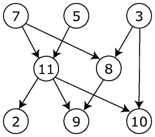

Topological Sorting
=========

A topological sort (sometimes abbreviated topsort or toposort) or topological ordering of a directed graph is a linear ordering 
of its vertices such that for every directed edge uv from vertex u to vertex v, u comes before v in the ordering. For instance, 
the vertices of the graph may represent tasks to be performed, and the edges may represent constraints that one task must be performed 
before another; in this application, a topological ordering is just a valid sequence for the tasks. A topological ordering is possible 
if and only if the graph has no directed cycles, that is, if it is a directed acyclic graph (DAG). Any DAG has at least one topological 
ordering, and algorithms are known for constructing a topological ordering of any DAG in linear time.

##Complexity
	  Worst case performance  O(|E| + |V|)
	  Worst case space complexity O (|V|)

##Install

This library has the java implementation of Topological Sorting using Kahn, Arthur B's algorithm to find the topological sorted order in a directed graph G=[V,E].The 
following code snippet shows how to get the topological order,

    TopologicalSorting topologicalSort=new TopologicalSorting();
	ArrayList<Integer> topoSort=topologicalSort.getTopologicalOrder();

###Input
	8 9
	1 4 1
	1 5 2
	2 4 3
	3 5 4
	3 8 5
	4 6 6
	4 7 7
	4 8 8
	5 7 9

First integer is the total number of vertices |V| in the graph G. The next integer is the number of edges |E| in the graph.
Next |E| lines has the edges information (u, v, w). All inputs must be given through terminal.

###Output
	 1 2 3 4 5 6 8 7
  
##Project Contributor

* Dinesh Appavoo ([@DineshAppavoo](https://twitter.com/DineshAppavoo))
